## 들어가며

BMS 펌웨어 업무를 주로 하다가 최근 모터 제어 프로젝트를 맡게 되면서 **maxon ESCON 50/5** 서보 컨트롤러를 다룰 일이 생겼습니다. maxon 모터 전용 컨트롤러로 잘 알려진 ESCON에 **국산 BLDC 모터**(모터뱅크의 BL57101E1K)를 물려 돌려야 하는 상황이었는데, 예상대로 몇 가지 함정이 있었습니다.

국내에 maxon ESCON 관련 한국어 자료가 거의 없고, 특히 **국산 BLDC 모터와 조합하는 경험**은 찾기 어려워서 오늘 전체 과정을 정리해봅니다. 같은 상황을 겪는 다른 엔지니어분들께 도움이 되었으면 합니다.

## 하드웨어 구성

이번 셋업에 사용한 하드웨어입니다.

| 구성 | 제품 | 주요 사양 |
|---|---|---|
| 서보 컨트롤러 | maxon ESCON 50/5 (#409510) | 50V, 연속 5A / 피크 15A |
| BLDC 모터 | 모터뱅크 BL57101E1K | 24V, 200W, 57각, Hall + 1000CPR 엔코더 |
| 감속기 | 모터뱅크 PGH56S | 1단 유성감속, 1:16, 백래시 15arcmin |
| 제어 MCU | STM32 (계획) | PWM + GPIO로 속도/방향 제어 |

### 모터 사양서

모터뱅크에서 받은 BL57101E1K 사양서입니다.


핵심 수치를 정리하면:

- 3상, 8폴 → Pole Pairs = 4 (라고 적혀있지만... 이후에 반전됨)
- 정격 전압: 24 VDC
- 무부하 속도: 3700 ±10% RPM
- 정격 속도: 3000 RPM
- 정격 토크: 0.63 Nm
- 정격 출력: 200W
- 정격 최대 전류: 12A 이하

### 감속기 사양

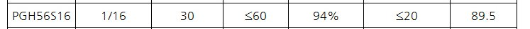

PGH56S16은 56mm 플랜지 1단 유성감속기로, 감속비 1:16, 효율 94%, 백래시 ≤60 arcmin (고정밀 사양은 ≤15 arcmin) 등이 스펙입니다.

## 사양서 해석의 함정 — 미리 경고

먼저 이 포스트에서 가장 중요한 교훈부터 말씀드리자면, **국산/중국산 BLDC 사양서의 극수와 엔코더 분해능 표기는 그대로 믿으면 안 됩니다**. 이번 셋업에서 사양서 값과 실측값이 다른 경우가 2건 있었습니다.

| 항목 | 사양서 | 실제 (ESCON 실측) |
|---|---|---|
| 극수 (Pole Pairs) | 4 (8폴) | **2** (4폴) |
| 엔코더 분해능 | 1000 CPR | **500 CPR** |

이유는 뒤에서 자세히 설명합니다. 일단 **ESCON의 Diagnostics 툴이 이런 오류를 자동으로 잡아준다**는 점만 기억해주세요.

## Startup Wizard 단계별 설정

ESCON Studio를 실행하면 Startup Wizard가 자동으로 뜹니다. 전체 18단계인데 주요 화면만 정리하겠습니다.

### Motor Data

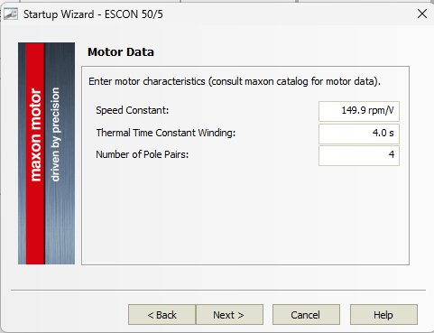

- **Speed Constant**: 149.9 rpm/V
  - 계산: 무부하 3700rpm ÷ 24V ≈ 154 rpm/V
  - IR 강하 고려해 약간 낮춘 값이 적절
- **Thermal Time Constant Winding**: 4.0s
  - 정확값 모르면 보수적으로 설정
  - 57각 200W급이면 30s 권장하지만 Current Limit을 낮게 잡으면 보수적 값으로도 안전
- **Number of Pole Pairs**: 4
  - 사양서 기준 입력 (나중에 2로 변경됨)

### System Data

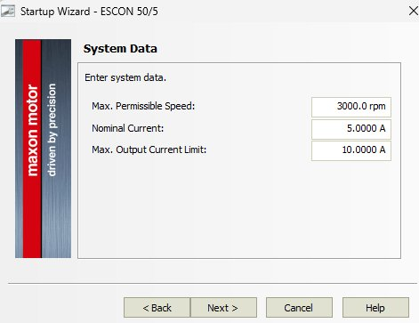

- **Max. Permissible Speed**: 3000 rpm
  - 실제로는 4000 rpm 권장 (무부하 3700 + 마진)
- **Nominal Current**: 5.0 A
  - ESCON 50/5 연속 정격에 맞춤
  - 모터는 8.3A 견딜 수 있지만 컨트롤러 한계가 5A
- **Max. Output Current Limit**: 10.0 A
  - 피크 제한값, 모터 최대 12A 이내

이 단계에서 이미 **ESCON 50/5는 이 모터에 약간 작다**는 점이 드러납니다. 연속 고부하 운전이면 ESCON 70/10 선택이 정답이지만, 저부하 테스트용이라 50/5로 충분합니다.

### Detection of Rotor Position

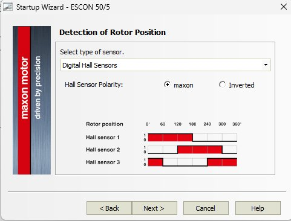

- **Sensor Type**: Digital Hall Sensors
- **Hall Sensor Polarity**: maxon

국산 BLDC라 Polarity가 maxon 표준과 다를 수 있어 초기 설정은 maxon으로 두고, Diagnostics에서 자동 검증하도록 합니다.

### Speed Sensor

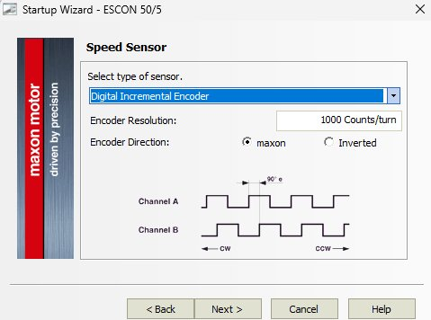

- **Sensor Type**: Digital Incremental Encoder
- **Encoder Resolution**: 1000 Counts/turn
- **Encoder Direction**: maxon

> **중요 포인트**: ESCON은 내부적으로 4체배(quadrature decoding)를 자동 적용합니다. 사용자는 엔코더 원래 분해능(1000 CPR 또는 실제로는 500 CPR)만 입력하면 되고, 4000을 직접 넣으면 안 됩니다.

### Enable 모드

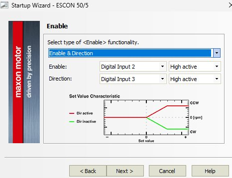

- **Functionality**: Enable & Direction
- **DI2**: Enable (High active)
- **DI3**: Direction (High active)

Enable 모드는 여러 선택지가 있습니다.

| 모드 | 특징 | 용도 |
|---|---|---|
| `Enable` | 1핀, 양극성 Set Value | 가장 단순, 실습용 |
| **`Enable & Direction`** | 2핀, 단극성 Set Value | 공장 HMI 스타일 (선택) |
| `Enable CW & Enable CCW` | 2핀, 방향별 Enable | 리미트 스위치 인터록 |
| `Enable & Stop` | 2핀, 제어된 감속 정지 | 의료기기 등 안전 응용 |

사람이 타는 기기(Smart Rollator 등)라면 `Enable & Stop`도 좋은 선택입니다.

### Set Value — PWM 입력

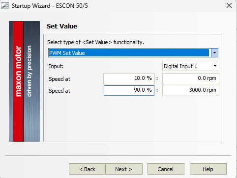

- **Functionality**: PWM Set Value
- **Input**: Digital Input 1
- **Speed at 10% duty**: 0 rpm
- **Speed at 90% duty**: 3000 rpm

STM32의 Timer PWM 출력을 ESCON DI1에 바로 물려 속도 제어할 계획이라 PWM 모드 선택했습니다. 10%/90% 엔드포인트로 여유를 둔 것은 안전 설계 관행입니다.

> **왜 0%/100%가 아닌가?**
>
> - 0% duty는 "신호 없음"과 구분 불가 → 케이블 단선, MCU 초기화 실패와 혼동됨
> - 100% duty도 "고정 High"와 구분 불가 → 단락 사고 시 폭주 위험
> - 10%~90% 구간만 사용하면 0%/100%를 에러로 감지 가능

### Current Limit & Speed Ramp

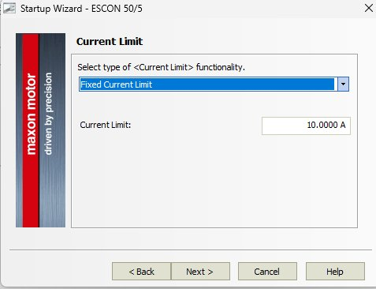

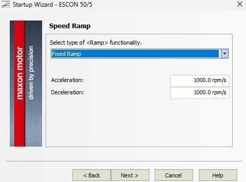

- **Current Limit**: Fixed, 10.0 A
- **Acceleration / Deceleration**: 1000 rpm/s (0→3000rpm 3초)

초기 실험이므로 보수적으로 설정했습니다. 의료기기처럼 부드러운 가속이 필요하면 이 정도가 적절하고, 일반 서보 응용이면 3000~5000 rpm/s로 올려야 합니다.

### Offset

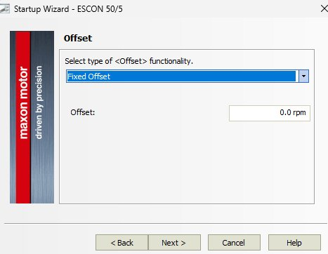

- **Type**: Fixed Offset, 0.0 rpm

초기 설정에서는 0으로 두고, 실제 운전에서 Set Value가 0인데 모터가 미세 회전하면 그때 보정합니다.

### Digital I/O

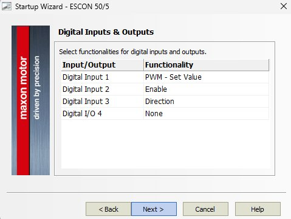

| 핀 | 기능 |
|---|---|
| DI1 | PWM Set Value (MCU PWM 출력) |
| DI2 | Enable (MCU GPIO) |
| DI3 | Direction (MCU GPIO) |
| DI/O4 | None (예비) |

DI/O4에 **Ready 출력**을 할당하면 MCU가 ESCON 에러 상태를 즉시 감지할 수 있어 안전 중요 응용에 유용합니다. 이번 셋업에서는 일단 비워뒀습니다.

### Analog I/O

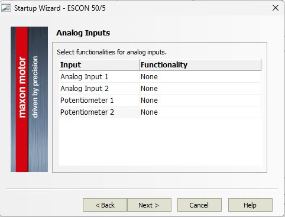

Analog 입력은 모두 None (PWM 사용).

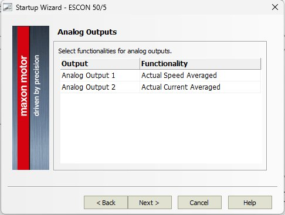

Analog 출력은 **디버깅/모니터링용**으로 활용합니다.

- **AO1**: Actual Speed Averaged
- **AO2**: Actual Current Averaged

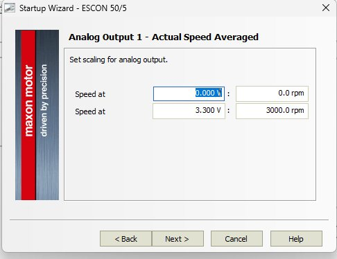

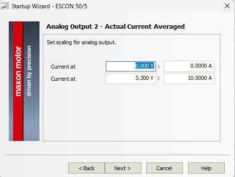

- **AO1**: 0.000V → 0 rpm / 3.300V → 3000 rpm
- **AO2**: 0.000V → 0 A / 3.300V → 10 A

**3.3V 최대값**으로 설정한 이유는 STM32 ADC 레퍼런스와 일치시켜 full scale을 꽉 채우기 위함입니다. STM32 12bit ADC 기준으로:

- 속도 분해능: 3000/4096 ≈ 0.73 rpm/LSB
- 전류 분해능: 10/4096 × 1000 ≈ 2.4 mA/LSB

### Configuration Summary

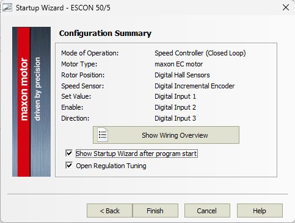

모든 설정이 한 화면에 요약됩니다. **Show Wiring Overview 버튼**은 꼭 클릭해서 배선도를 캡처해두세요. 실제 배선 작업 시 필수 자료입니다.

## Diagnostics — 실전 트러블슈팅

Startup Wizard 완료 후 바로 Auto Tuning을 돌리면 안 됩니다. 반드시 **Diagnostics 툴로 배선과 센서 방향을 먼저 검증**해야 합니다. 이 단계에서 국산 BLDC 특유의 문제가 대부분 드러납니다.

### System Configuration 설정

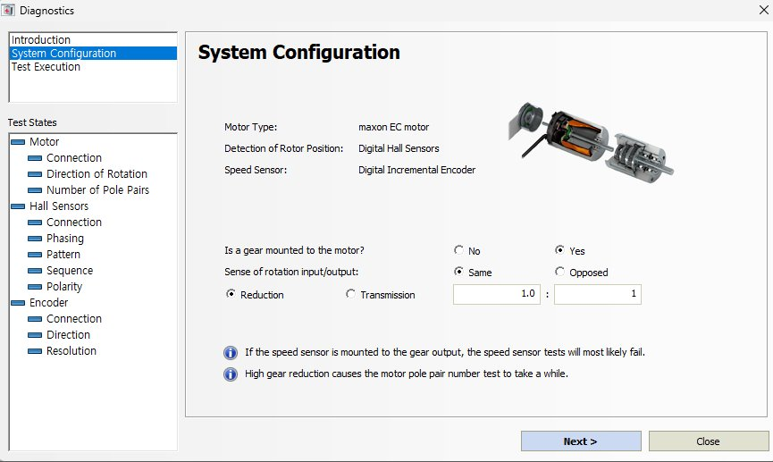

기본 화면입니다. 여기서 **감속기 정보를 정확히 입력**해야 합니다.

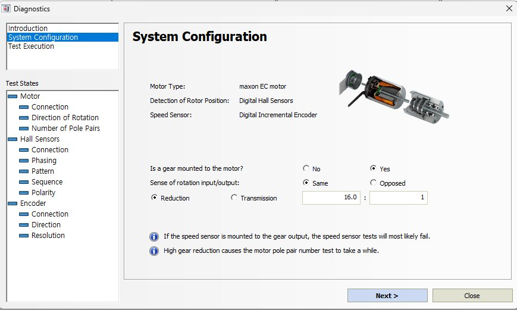

- **Is a gear mounted to the motor?**: Yes
- **Sense of rotation**: Same
- **Reduction**: 16.0 : 1

PGH56S는 1단 유성감속기라 모터 회전과 출력 회전 방향이 동일(Same)합니다. 감속비 16:1을 정확히 입력하지 않으면 Pole Pairs 테스트가 엉뚱한 결과를 냅니다.

> **주의**: 화면 하단 경고처럼 "speed sensor가 감속기 출력에 장착되어 있으면 테스트 실패 가능"합니다. BL57101E1K는 **엔코더가 모터 뒷단에 장착**되어 있어 이 문제는 없습니다.

### Test Execution 시작

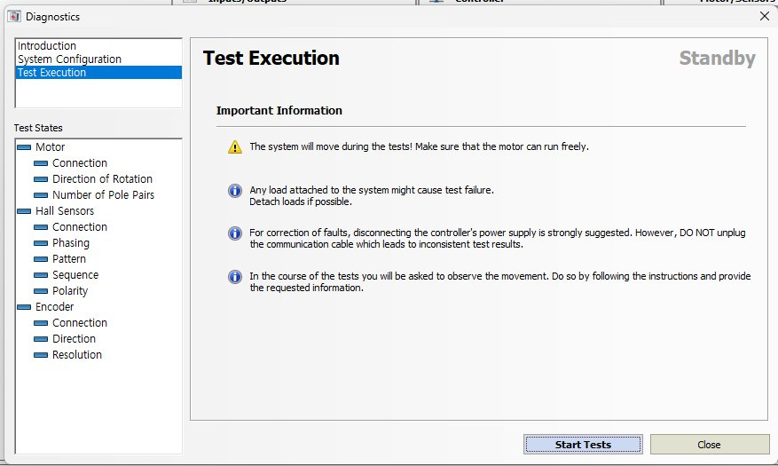

"Standby" 상태에서 `Start Tests` 클릭. 11개 항목을 순차 자동 검증합니다. 검증 중 **모터가 자동으로 회전**하므로 안전 공간 확보가 중요합니다.

### 문제 1: Motor Direction of Rotation Failed ❌

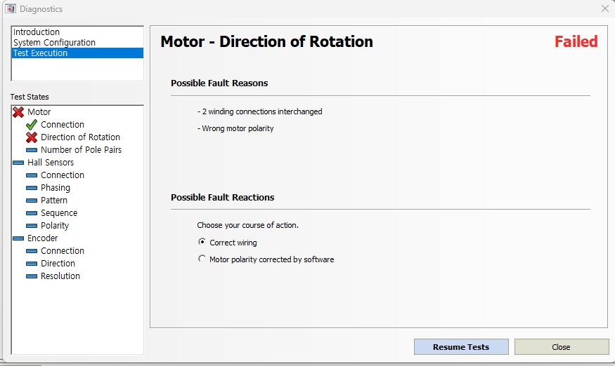

첫 번째 실패. 에러 메시지:

```
Possible Fault Reasons:
- 2 winding connections interchanged
- Wrong motor polarity
```

**원인**: BL57101E1K의 3상 권선 극성 정의가 maxon 표준과 다름. 국산 BLDC에서 흔히 발생.

**해결 선택지**:
1. `Correct wiring`: 전원 OFF 후 3상 중 2개 선 교체
2. `Motor polarity corrected by software`: 소프트웨어 보정 ⭐

저는 **소프트웨어 보정**을 선택했습니다. 배선 재작업 없이 즉시 해결 가능하고, 다른 모터 설정들과의 일관성도 확보됩니다. Resume Tests로 진행.

### 문제 2: Number of Pole Pairs Failed ❌

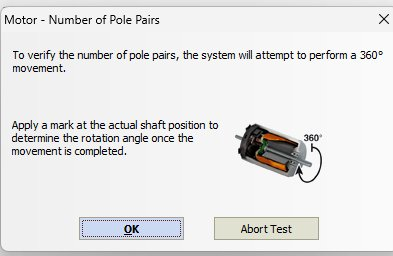

극쌍 수 검증은 **사용자 참여 테스트**입니다. 모터축에 마크를 붙이고 360° 전기 회전 명령 시 실제 기계적 회전각을 관찰해야 합니다.

4 pole pairs면 1/4 회전(90°), 2 pole pairs면 1/2 회전(180°)이 정상.

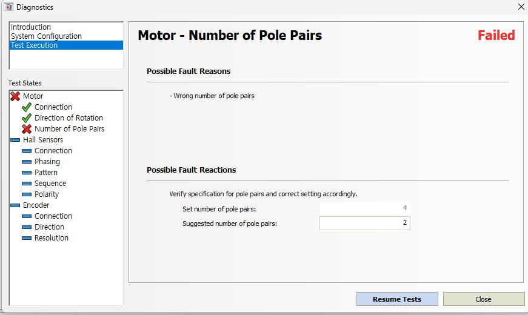

결과:

```
Set number of pole pairs:       4   (사용자 입력)
Suggested number of pole pairs: 2   (ESCON 실측)
```

**이게 가장 중요한 발견**이었습니다. 사양서에 "3상 8폴"로 적혀있지만 실제 모터는 **4극(2 pole pairs)** 구조입니다.

### 왜 "8폴" 표기가 4극일까?

BLDC 모터 사양서의 극수 표기는 제조사마다 혼용됩니다.

| 표기 | 의미 | Pole Pairs |
|---|---|---|
| "8 Poles" (총 극 수) | N극 4 + S극 4 | 4 |
| "8 Poles" (한쪽만) | N극 8 | 8 |
| **실제 BL57101E1K** | ESCON 실측 결과 | **2** |

3700 rpm이라는 높은 무부하 속도를 생각하면 **4극(2 pole pairs)**이 물리적으로도 일관됩니다. 극수가 많으면 토크는 커지지만 속도는 느려지는 경향이 있거든요.

설정값을 2로 수정하고 Resume.

### 문제 3: Encoder Direction Failed ❌

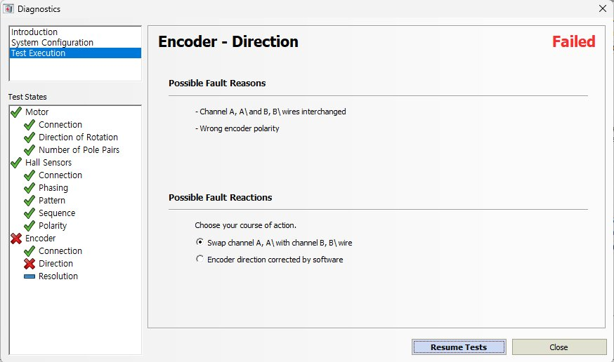

Motor polarity를 소프트웨어로 뒤집었더니 이번엔 **엔코더 방향이 반대**가 되었습니다. 예상된 부작용.

해결은 동일하게 **`Encoder direction corrected by software`** 선택. 일관된 정책입니다.

### 문제 4: Encoder Resolution Failed ❌

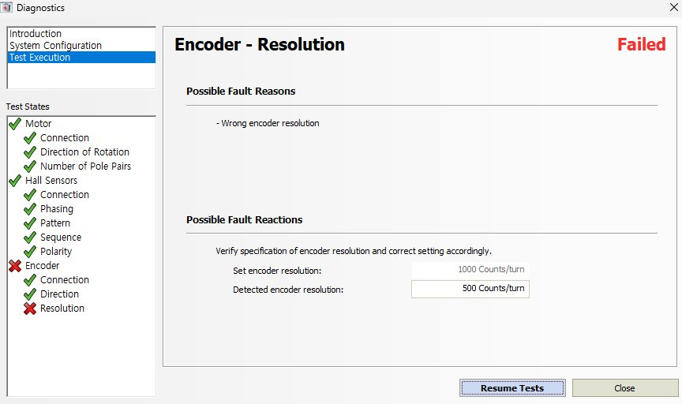

결과:

```
Set encoder resolution:      1000 Counts/turn
Detected encoder resolution:  500 Counts/turn
```

**정확히 절반**. 이 패턴은 엔코더 사양 표기 혼용에서 비롯됩니다.

### "2CH 1000CPR"의 진짜 의미

엔코더 사양에서 "1000 CPR"은 여러 해석이 가능합니다.

| 해석 | 엔코더 슬릿 수 | ESCON 입력값 |
|---|---|---|
| 채널당 1000 펄스 | 1000 | 1000 |
| **2채널 합계 1000 펄스** | **500** | **500** ⭐ |
| 4체배 후 1000 카운트 | 250 | 250 |

BL57101E1K는 **해석 2**에 해당합니다. 엔코더 디스크에 500개의 슬릿이 있고, A채널 500 + B채널 500 = 합계 1000으로 제조사가 표기한 것입니다. 중국 OEM 관행에서 흔합니다.

Detected 값 500을 그대로 적용하고 Resume.

### All Tests Passed 🎉

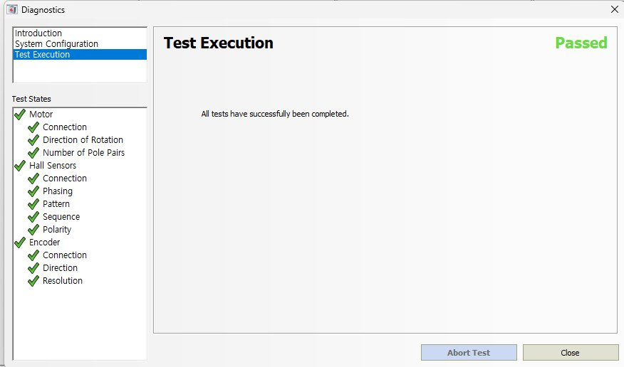

드디어 11개 테스트 모두 통과!

```
Motor:        3/3 ✅
Hall Sensors: 5/5 ✅
Encoder:      3/3 ✅
```

**특히 Hall Sensors 5개 항목이 한 번에 Pass한 것은 주목할 만한 결과**입니다. BL57101E1K의 Hall 배치가 maxon 표준(120° 배치)과 완전히 호환된다는 뜻입니다.

### Diagnostics로 확정된 설정값

| 항목 | 초기값 | 최종값 | 변경 사유 |
|---|---|---|---|
| Pole Pairs | 4 | **2** | ESCON 실측 |
| Motor Polarity | maxon | **Software corrected** | 국산 모터 특성 |
| Encoder Resolution | 1000 | **500 Counts/turn** | 사양서 표기 차이 |
| Encoder Direction | maxon | **Software corrected** | Motor 보정의 연쇄 |
| Hall Polarity | maxon | maxon (유지) | 호환 확인 |

## Auto Tuning — 화룡점정

Diagnostics 완료 후 바로 Regulation Tuning → Auto Tuning 실행.

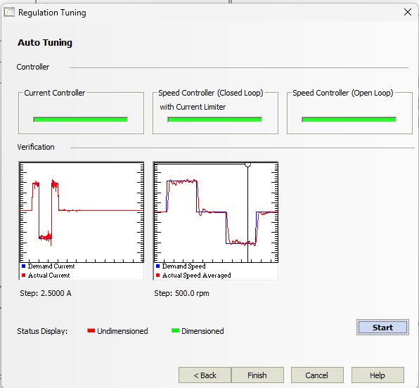

**결과: 3개 제어 루프 모두 Dimensioned (Green)** 🎯

```
Current Controller                 : 🟢 Dimensioned
Speed Controller (Closed Loop)     : 🟢 Dimensioned
  with Current Limiter
Speed Controller (Open Loop)       : 🟢 Dimensioned
```

### Verification 그래프 해석

**왼쪽 (Current Loop)**:
- Step: 2.5A
- 파란선(명령)을 빨간선(실측)이 거의 완벽 추종
- Rise time 수 ms 이내, 오실레이션 빠르게 수렴
- 전류 루프 대역폭 약 1 kHz 수준 추정

**오른쪽 (Speed Loop)**:
- Step: 500 rpm (양방향 +500 / -500 / 0)
- Overshoot 5% 이내
- Settling time 100 ms 이내
- Steady-state error 거의 0
- CW/CCW 대칭성 우수

**정성적 평가**: ⭐⭐⭐⭐⭐ — 일반 산업 응용에 충분한 수준.

## 최종 설정값 요약

### Startup Wizard 입력값

| 화면 | 항목 | 값 |
|---|---|---|
| Motor Data | Speed Constant | 149.9 rpm/V |
| | Thermal Time Constant | 4.0 s |
| | **Pole Pairs** | **2** (Diagnostics 후) |
| System Data | Max. Permissible Speed | 3000 rpm |
| | Nominal Current | 5.0 A |
| | Max. Output Current | 10.0 A |
| Rotor Position | Sensor | Digital Hall Sensors |
| | Polarity | maxon |
| Speed Sensor | Sensor | Digital Incremental Encoder |
| | **Resolution** | **500 Counts/turn** (Diagnostics 후) |
| | Direction | maxon (소프트웨어 보정됨) |
| Mode | Operation | Speed Controller (Closed Loop) |
| Enable | Mode | Enable & Direction (DI2/DI3) |
| Set Value | Type | PWM Set Value (DI1) |
| | Speed at 10% | 0 rpm |
| | Speed at 90% | 3000 rpm |
| Current Limit | Fixed | 10 A |
| Speed Ramp | Acc / Dec | 1000 / 1000 rpm/s |
| Offset | Fixed | 0 rpm |
| AO1 | Actual Speed | 0V=0rpm / 3.3V=3000rpm |
| AO2 | Actual Current | 0V=0A / 3.3V=10A |

### 배선 요약

```
[STM32 MCU]              [ESCON 50/5]
TIM_CHx (PWM)    ────>   Digital Input 1
GPIO (Enable)    ────>   Digital Input 2
GPIO (Direction) ────>   Digital Input 3
ADC1             <────   Analog Output 1 (Speed)
ADC2             <────   Analog Output 2 (Current)
GND              ────    Signal GND

[전원]
+24V DC 15A      ────>   +V Power
GND              ────>   Power GND

[모터 BL57101E1K]        [ESCON 50/5]
U / V / W               Motor U/V/W
Hall +5V/GND/H1/H2/H3   Hall Sensor 5핀
Enc +5V/GND/A/B         Encoder 4핀
```

## 이번 프로젝트의 교훈

### 1. 국산 BLDC 사양서의 함정을 인지하라

- "8 Poles" ≠ 4 pole pairs (실측 2 pole pairs)
- "1000 CPR" ≠ 1000 counts per channel (실측 500 per channel)
- 제조사 표기 관행이 서구와 다름

앞으로 엔코더 구입 시 **"실제 디스크 슬릿 수는 몇 개인가?"**를 명시적으로 질문해야 합니다.

### 2. Diagnostics 툴은 사양서 오류까지 잡아낸다

maxon ESCON의 진짜 가치는 **Diagnostics에 있다**고 생각합니다. Auto Tuning 전에 반드시 Diagnostics를 먼저 돌려야 합니다.

- 배선 오류 → 자동 검출
- 사양서 오류 → 자동 보정 제안
- 센서 방향 → 소프트웨어 보정 옵션 제공

### 3. 소프트웨어 보정이 배선 교체보다 유리

국산 BLDC는 대부분 극성/방향이 maxon 표준과 다릅니다. 매번 배선을 뜯어 바꾸지 말고 **소프트웨어 보정**을 일관되게 사용하면:

- 즉시 해결 가능
- 설정 파일로 저장되어 재현 가능
- 배선 실수로 인한 2차 문제 없음

### 4. PWM 제어는 임베디드 친화적이지만 필터링 주의

ESCON의 PWM Set Value는 MCU에서 DAC 없이 속도 제어 가능하게 해주는 훌륭한 기능이지만:

- 저속 영역에서 리플 때문에 떨림 발생 가능
- 10%/90% 엔드포인트로 Fail-safe 설계
- MCU 부팅 시 PWM 초기 상태 주의

## 다음 할 일

- [ ] 파라미터 파일 `.edc`로 저장 및 Git 저장소 커밋
- [ ] STM32 펌웨어에 PWM + Enable + Direction 제어 로직 구현
- [ ] ADC로 AO1/AO2 읽어 속도/전류 모니터링
- [ ] Data Recorder로 실제 부하 조건 응답 측정
- [ ] 필요 시 Expert Tuning으로 Controller Stiffness 미세 조정

## 참고 자료

- [maxon ESCON Studio 공식 문서](https://www.maxongroup.com/maxon/view/content/escon-detailsite)
- [ESCON 50/5 Hardware Reference (maxon)](https://www.maxongroup.com/medias/sys_master/root/8837504466974/409510-ESCON-50-5-Hardware-Reference-En.pdf)
- [모터뱅크 BL57101E1K 상품 페이지](https://www.motorbank.kr/)

---

**포스트를 마치며**

이번 경험을 통해 maxon ESCON과 국산 BLDC 모터 조합의 실전 노하우를 쌓았습니다. 특히 사양서 표기의 함정과 Diagnostics 툴의 강력함을 몸으로 배운 것이 가장 큰 수확입니다.

같은 조합으로 고민하시는 분들께 이 포스트가 도움이 되길 바랍니다. 질문이나 경험 공유는 댓글로 부탁드립니다.

BMS 펌웨어를 주로 다루다가 모터 제어로 영역을 넓히면서, 임베디드 시스템의 전력 전자(power electronics) 측면을 더 깊이 이해하게 되었습니다. 다음에는 이 모터와 STM32를 실제로 물려 PWM 속도 제어 펌웨어 코드를 포스팅하겠습니다.
